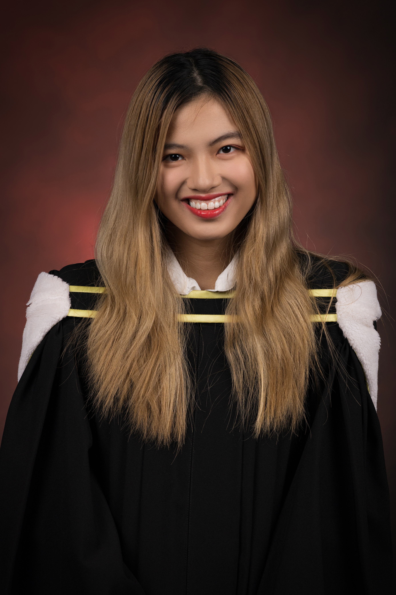

# About Me 

I am third-year student at McGill University, pursuing a BSc in Statistics and Computer Science.  I went to high school in United Kingdom to do my A-level. I was majoring in Natural Science with Gold Medal in Senior Mathematical Challenge and Gold Award in GEO SPECIALTY CHEMICALS Challenge. When I started university, I changed my major to Statistics and Computer Science as I find Machine Learning and AI quite interesting and my goal is to build model that can think and act intelligently to help human in everyday tasks. 

My academic interests include: 
+ Applied Statistics, Regression
+ Machine Learning, AI
+ Financial Mathematics
+ Discrete Maths and Algorithm. 

I also work part-time to support my living. I worked as Sale Assistant at McGill Le James Bookstore, Communications Assistant at University Advancement and Undergraduate Teaching Assistant for Probability and Linear Algebra I. 

When I am not stuyding or working, I spend most of my time cooking and doing yoga. My favourite recipe is "Mi Quang"- a popular dish in South of Vietnam. I also love spending time hanging out with my friends. 

### Cool People I Met 
+ [Diego Lopez](https://diegolopez.me/)
+ [Anna Brandenberger](https://abrandenberger.github.io/)
+ [Shereen Elaidi](https://shereenelaidi.github.io/)
+ [Viet Nguyen](https://opent03.github.io/)
+ [Tiffany Yong](https://tiffanyyong.github.io/)
+ [KC](https://kctsiolis.github.io/)
+ [Dao Chen Yuan](https://daocheny.github.io/)
+ [Maia Darmon ](https://maiadd.github.io/)

