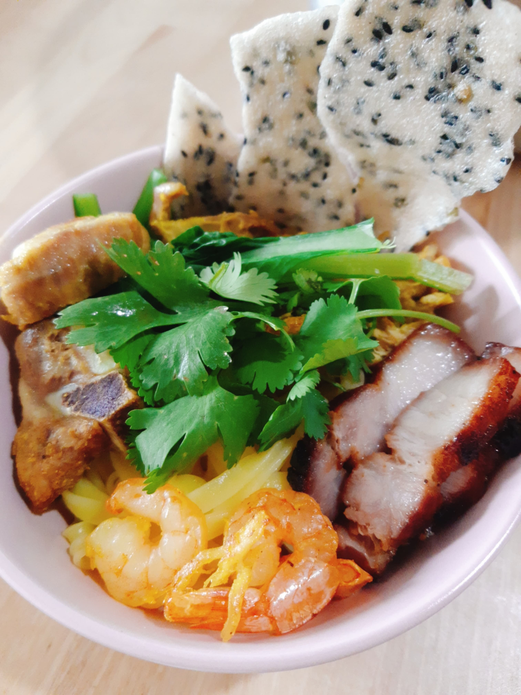

This is the place for Mia's delicious recipes. I spent my whole summer to recreate my Vietnamese dishes and also try out different cuisine. 

Here is my favorite recipe " Mi Quang". This dish originated from Quang Nam province and it is a popular breakfast and lunch dish. I first tried it out after reading a famous novel by author Nguyen Nhat Anh and the reason why I love this dish is because of its perfect combination of shrimp, chicken, pork, fish in chicken broth and the turmeric for the yellowish color. 

